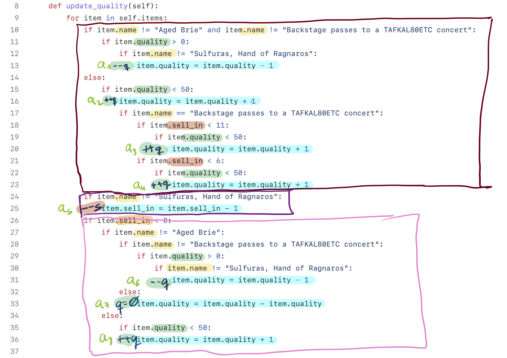
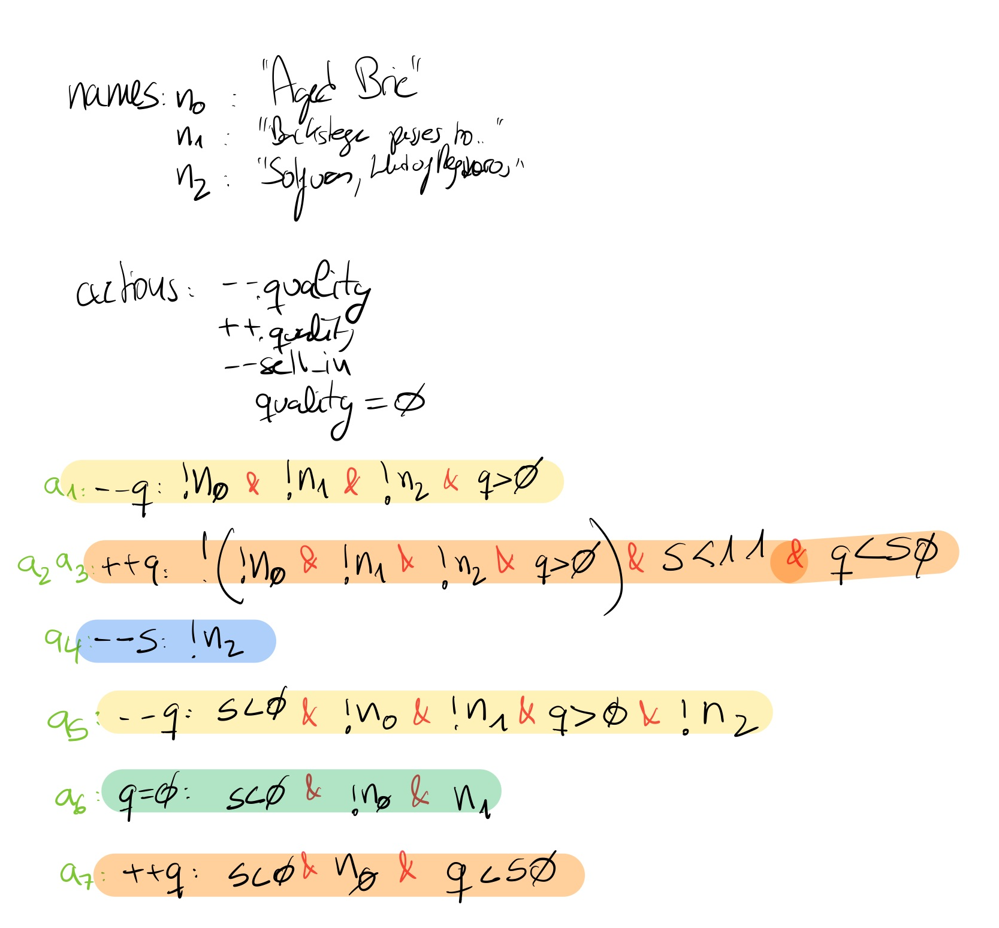
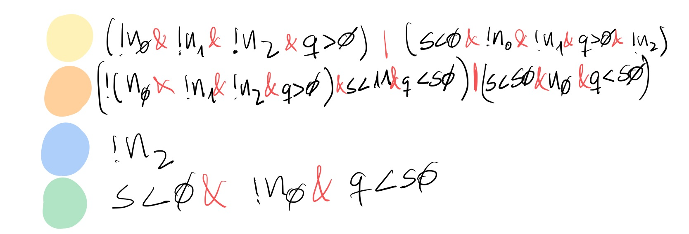
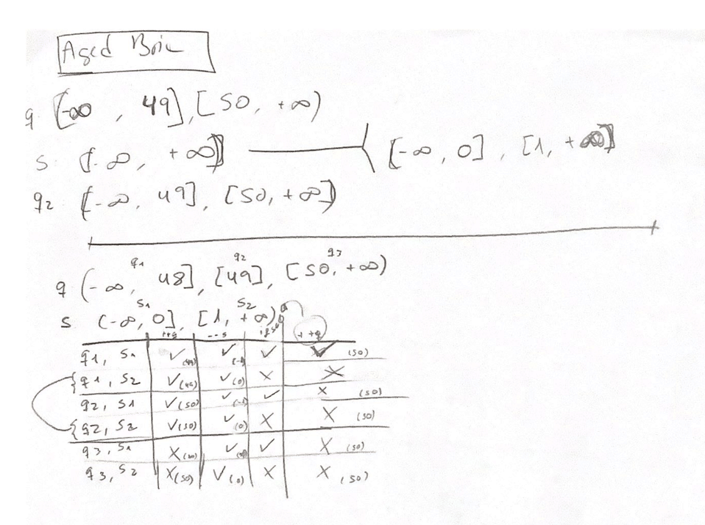
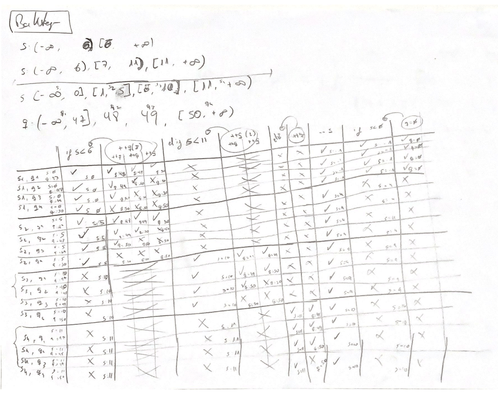
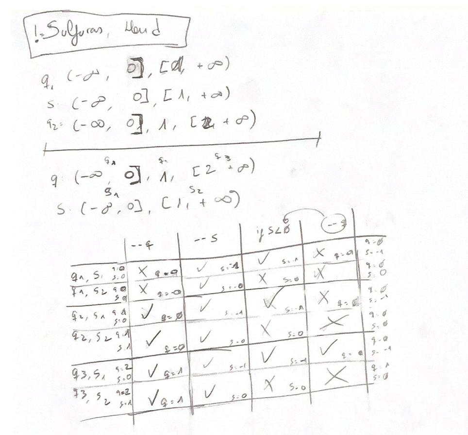

# Josep Bernad's Gilded Rose resolution

This is the python version of the Gilded Rose, and its original code and repository can be found [here](https://github.com/emilybache/GildedRose-Refactoring-Kata).

## 1. Initial analysis

In order to have a deep understanding of the code, I highlighted the different properties of the object ``Item`` that are being evaluated in the `ìf` statements. After this step, I was able to notice that there weren't too many values that were considered in the different evaluations.

```name```:
- _"Aged Brie"_
- _"Backstage passes to a TAFKAL80ETC concert"_
- _"Sulfuras, Hand of Ragnaros"_
- Any other string

```quality```:
- ```> 0```
- ```< 50```

```sell_in```:
- ```< 11```
- ```< 6```
- ```< 0```

I noticed as well that there weren't too many operations (actions) to execute in the ```if``` statements:
- ```quality -= 1``` (if ```quality > 0```)
- ```quality += 1``` (if ```quality < 50```)
- ```sell_in -= 1```
- ```quality = 0```


Finally, I divided the code in three big blocks in order to try to see what could be simplified. 

The final code with all the visual comments:



## 2. The first attempt

Using all the information from the code with my comments, the first strategy I came out with was to trace all the values that every property had to have in order to execute each action.
The result can be seen in the next image:



After this exercise, I tried to merge and simplify the different actions into only one, having this result:



It didn't take me too much time to realize that this was not a good strategy, but I had some initial conclusions that for sure helped me later on.

## 3. Still no solution but new ideas

The solution was still out of my reach, but I had many ideas and data to keep working:
- I could start dividing the problem by the ```name``` property, that should simplify the code.
- We know that every time the ```quality``` property is increased or decreased, it's previously checked, so it is in the range ```[0, 50]```.
- To simplify even more the code, I had to get rid of the nested levels and replace them with the  ```ìf elif else``` structures. This increases the readability and the simplicity of the code.

## 4. How can I test it? Part I

I wanted to be as agile as possible to check my solutions so the first solution I came out with was to compare it with the output of the original ```gilded_rose``` output.
Great, I had a reliable source of valid output to compare to, but... which initial values do I need?

For a quick and dirty solution I basically made all the possible combinations between ```name```, ```quality```, and ```sell_in```.
The first property had to be one of the four values discussed on the first chapter ```{"Aged Brie", "Backstage passes to a TAFKAL80ETC concert", "Sulfuras, Hand of Ragnaros" and ""}``` and the values of ```quality``` and ```sell_in``` were all the values in the range of ```[-100, 100]```.

This setup created a test set of **161.604** Items.

`n = 201 * 201 * 4`

Not the most elegant solution, but rather an effective one. Despite the number of elements to process, the whole test was run in **less than 2 segonds**, so I considered it good enough.

Take a look:

````python
class GildedRoseTest(unittest.TestCase):

    NAMES = [
        "Aged Brie",
        "Backstage passes to a TAFKAL80ETC concert",
        "Sulfuras, Hand of Ragnaros",
        ""
    ]

    def testBruteForce(self):
        days = 2

        itemsOriginal = []
        itemsProcessed = []
        itemsProcessedOriginal = []

        for i in range(-100, 101):
            for j in range(-100, 101):
                for name in self.NAMES:
                    itemsOriginal.append(Item(name=name, sell_in=i, quality=j))
                    itemsProcessed.append(Item(name=name, sell_in=i, quality=j))
                    itemsProcessedOriginal.append(Item(name=name, sell_in=i, quality=j))

        for i in range(1, days):
            GildedRose(itemsOriginal).update_quality()
            GildedRoseJosep(itemsProcessed).updateQuality()

            for j in range(len(itemsOriginal) - 1):
                if itemsOriginal[j].quality != itemsProcessed[j].quality or \
                        itemsOriginal[j].sell_in != itemsProcessed[j].sell_in:
                    print("------ " + i.__str__() + " ------")
                    print("Item original:" + itemsOriginal[j].__repr__())
                    print("Item processed original:" + itemsProcessedOriginal[j].__repr__())
                    print("Item processed:" + itemsProcessed[j].__repr__())
                    self.assertEqual(itemsOriginal[j].quality, itemsProcessed[j].quality)
                    self.assertEqual(itemsOriginal[j].sell_in, itemsProcessed[j].sell_in)
````

Once I had the test ready to run, it was time to unfold the `ìf` statements.

## 5. Refactoring for the win

The first attempt was to keep the code as original as possible but using the next structure:

````python
if item.name == "Aged Brie":
    // Do stuff
elif item.name == "Backstage passes to a TAFKAL80ETC concert":
    // Do other stuff
elif item.name == "Sulfuras, Hand of Ragnaros":
    // Do other stuff
else:
    // Do other stuff
````

This was the main strategy that I chose to follow because the only thing I had left to do was simplify the code inside each case. The first idea I started implementing was to create a method to increase and decrease the property ```quality``` which could be called at any time and then inside it make sure that it's value was always in the specified range ```[0, 50]``` to modify the value.

Additionally, I created another method to increase the ``quality`` value by ``n`` and another one to decrease the ``sell_in``.

These methods were all I needed (I learned this from my initial analysis). Check out the final ``Item`` object:
````python
class Item:
    MAX_QUALITY = 50
    MIN_QUALITY = 0

    def __init__(self, name, sell_in, quality):
        self.name = name
        self.sell_in = sell_in
        self.quality = quality

    def increaseQuality(self):
        if self.quality < self.MAX_QUALITY:
            self.quality += 1

    def decreaseQuality(self):
        if self.quality > self.MIN_QUALITY:
            self.quality -= 1

    def increaseQualityBy(self, n):
        for i in range(0, n):
            self.increaseQuality()

    def decreaseSellIn(self):
        self.sell_in -= 1

    def __repr__(self):
        return "%s, %s, %s" % (self.name, self.sell_in, self.quality)
````
Of course, I created the constants MAX_QUALITY and MIN_QUALITY for extra readability and futureproof.

## 6. The final code

After some thinking process and using the auxiliary methods, I ended up with the next GildedRose class:

````python
class GildedRoseJosep(object):

    def __init__(self, items):
        self.items = items

    def updateQuality(self):
        for item in self.items:
            if item.name == "Aged Brie":
                item.increaseQuality()
                item.decreaseSellIn()
                if item.sell_in < 0:
                    item.increaseQuality()

            elif item.name == "Backstage passes to a TAFKAL80ETC concert":
                if item.sell_in < 6:
                    item.increaseQualityBy(3)
                elif item.sell_in < 11:
                    item.increaseQualityBy(2)
                else:
                    item.increaseQuality()
                item.decreaseSellIn()
                if item.sell_in < 0:
                    item.quality = 0

            elif item.name != "Sulfuras, Hand of Ragnaros":
                item.decreaseQuality()
                item.decreaseSellIn()
                if item.sell_in < 0:
                    item.decreaseQuality()
````

This solution have some advantages over the original one:
1. It's way easier to read and understand because there's a logic and clear path for each different ``name`` value.
2. It can be easily scaled to incorporate new ```name``` values if needed.
3. The code it's pretty self-explanatory of its behaviour. That's because there's one level of ``if`` nesting for each ```name``` value.

## 7. How can I test it? Part II

Now that I had a solution to go, I wanted to take special care of the test cases because it was not my best effort. The _brute-force_ method it's useful when you need a quick and dirty solution, but it is definitely not scalable and absolutely inefficient. For this reason I spent some time thinking what would be the minimal amount of tests required to check all possible flow paths.

I divided this problem (again) by the ```name``` value, creating specific cases of each one and to execute the tests, I created the next method to be called with the initial set of `Items` and the expected ones.

````python
def runTest(self, days, itemsExpected, itemsProcessed):
    for i in range(1, days):
        GildedRoseJosep(itemsProcessed).updateQuality()

        for j in range(len(itemsExpected) - 1):
            if itemsExpected[j].quality != itemsProcessed[j].quality or \
                    itemsExpected[j].sell_in != itemsProcessed[j].sell_in:
                print("------ Day: " + i.__str__() + " ------")
                print("------ Item: " + j.__str__() + " ------")
                print("Item expected:" + itemsExpected[j].__repr__())
                print("Item processed:" + itemsProcessed[j].__repr__())
                self.assertEqual(itemsExpected[j].quality, itemsProcessed[j].quality)
                self.assertEqual(itemsExpected[j].sell_in, itemsProcessed[j].sell_in)
````

### Aged brie

- Possible ```quality``` values:
  - q<sub>1</sub>: `(-∞, 48]`
  - q<sub>2</sub>: `49`
  - q<sub>3</sub>: `[50, +∞)`

- Possible ```sell_in``` values:
  - s<sub>1</sub>: `(-∞, 0]`
  - s<sub>2</sub>: `[1, +∞)`

Of all 6 possible combinations, two of them can be merged because of similar results: s<sub>2</sub>, q<sub>1</sub> and s<sub>2</sub>, q<sub>2</sub>



The final test:
````python
def testAgedBrie(self):
    days = 2

    s1 = 0
    s2 = 1

    q1 = 48
    q2 = 49
    q3 = 50

    itemsProcessed = [
        Item(name=self.NAMES[0], sell_in=s1, quality=q1),
        Item(name=self.NAMES[0], sell_in=s2, quality=q1),
        Item(name=self.NAMES[0], sell_in=s1, quality=q2),
        # Item(name=self.NAMES[0], sell_in=s2, quality=q2),
        Item(name=self.NAMES[0], sell_in=s1, quality=q2),
        Item(name=self.NAMES[0], sell_in=s2, quality=q3)
    ]

    itemsExpected = [
        Item(name=self.NAMES[0], sell_in=-1, quality=50),
        Item(name=self.NAMES[0], sell_in=0, quality=49),
        Item(name=self.NAMES[0], sell_in=-1, quality=50),
        # Item(name=self.NAMES[0], sell_in=0, quality=50),
        Item(name=self.NAMES[0], sell_in=-1, quality=50),
        Item(name=self.NAMES[0], sell_in=0, quality=50)
    ]

    self.runTest(days, itemsExpected, itemsProcessed)
````

Notice the commented lines for the redundant cases.

### Backstage passes to a TAFKAL80ETC concert

- Possible ```quality``` values:
  - q<sub>1</sub>: `(-∞, 47]`
  - q<sub>2</sub>: `48`
  - q<sub>3</sub>: `49`
  - q<sub>4</sub>: `[50, +∞)`

- Possible ```sell_in``` values:
  - s<sub>1</sub>: `(-∞, 0]`
  - s<sub>2</sub>: `[1, 5]`
  - s<sub>3</sub>: `[6, 10]`
  - s<sub>4</sub>: `[11, +∞)`

Although there's a total of 16 possible combinations I found that s<sub>3</sub>, q<sub>1</sub> and s<sub>3</sub>, q<sub>2</sub> threw the same results, just like s<sub>4</sub>, q<sub>1</sub>; s<sub>4</sub>, q<sub>2</sub> and s<sub>4</sub>, q<sub>3</sub>.



The final test:
````python
def testBackstage(self):
    days = 2

    s1 = 0
    s2 = 5
    s3 = 10
    s4 = 11

    q1 = 47
    q2 = 48
    q3 = 49
    q4 = 50

    itemsProcessed = [
        Item(name=self.NAMES[1], sell_in=s1, quality=q1),
        Item(name=self.NAMES[1], sell_in=s1, quality=q2),
        Item(name=self.NAMES[1], sell_in=s1, quality=q3),
        Item(name=self.NAMES[1], sell_in=s1, quality=q4),
        Item(name=self.NAMES[1], sell_in=s2, quality=q1),
        Item(name=self.NAMES[1], sell_in=s2, quality=q2),
        Item(name=self.NAMES[1], sell_in=s2, quality=q3),
        Item(name=self.NAMES[1], sell_in=s2, quality=q4),
        Item(name=self.NAMES[1], sell_in=s3, quality=q1),
        # Item(name=self.NAMES[1], sell_in=s3, quality=q2),
        Item(name=self.NAMES[1], sell_in=s3, quality=q3),
        Item(name=self.NAMES[1], sell_in=s3, quality=q4),
        Item(name=self.NAMES[1], sell_in=s4, quality=q1),
        # Item(name=self.NAMES[1], sell_in=s4, quality=q2),
        # Item(name=self.NAMES[1], sell_in=s4, quality=q3),
        Item(name=self.NAMES[1], sell_in=s4, quality=q4)
    ]

    itemsExpected = [
        Item(name=self.NAMES[1], sell_in=-1, quality=0),
        Item(name=self.NAMES[1], sell_in=-1, quality=0),
        Item(name=self.NAMES[1], sell_in=-1, quality=0),
        Item(name=self.NAMES[1], sell_in=-1, quality=0),
        Item(name=self.NAMES[1], sell_in=4, quality=50),
        Item(name=self.NAMES[1], sell_in=4, quality=50),
        Item(name=self.NAMES[1], sell_in=4, quality=50),
        Item(name=self.NAMES[1], sell_in=4, quality=50),
        Item(name=self.NAMES[1], sell_in=9, quality=49),
        # Item(name=self.NAMES[1], sell_in=9, quality=50),
        Item(name=self.NAMES[1], sell_in=9, quality=50),
        Item(name=self.NAMES[1], sell_in=9, quality=50),
        Item(name=self.NAMES[1], sell_in=10, quality=48),
        # Item(name=self.NAMES[1], sell_in=10, quality=49),
        # Item(name=self.NAMES[1], sell_in=10, quality=50),
        Item(name=self.NAMES[1], sell_in=10, quality=50)
    ]

    self.runTest(days, itemsExpected, itemsProcessed)
````

Notice (again) the commented lines for the redundant cases.

### Sulfuras, Hand of Ragnaros

This is the easiest case because there's no updated values. The result of the `Item` once processed is exactly the same.

To test it, I've created 4 different values for ```quality``` and for ``sell_in`` with random numbers (using all the possible integer values).

The final test:
````python
def testSulfuras(self):
    days = 2

    s1 = random.randint(-2147483648, 2147483647)
    s2 = random.randint(-2147483648, 2147483647)
    s3 = random.randint(-2147483648, 2147483647)
    s4 = random.randint(-2147483648, 2147483647)

    q1 = random.randint(-2147483648, 2147483647)
    q2 = random.randint(-2147483648, 2147483647)
    q3 = random.randint(-2147483648, 2147483647)
    q4 = random.randint(-2147483648, 2147483647)

    itemsProcessed = [
        Item(name=self.NAMES[2], sell_in=s1, quality=q1),
        Item(name=self.NAMES[2], sell_in=s1, quality=q2),
        Item(name=self.NAMES[2], sell_in=s1, quality=q3),
        Item(name=self.NAMES[2], sell_in=s1, quality=q4),
        Item(name=self.NAMES[2], sell_in=s2, quality=q1),
        Item(name=self.NAMES[2], sell_in=s2, quality=q2),
        Item(name=self.NAMES[2], sell_in=s2, quality=q3),
        Item(name=self.NAMES[2], sell_in=s2, quality=q4),
        Item(name=self.NAMES[2], sell_in=s3, quality=q1),
        Item(name=self.NAMES[2], sell_in=s3, quality=q2),
        Item(name=self.NAMES[2], sell_in=s3, quality=q3),
        Item(name=self.NAMES[2], sell_in=s3, quality=q4),
        Item(name=self.NAMES[2], sell_in=s4, quality=q1),
        Item(name=self.NAMES[2], sell_in=s4, quality=q2),
        Item(name=self.NAMES[2], sell_in=s4, quality=q3),
        Item(name=self.NAMES[2], sell_in=s4, quality=q4)
    ]

    itemsExpected = [
        Item(name=self.NAMES[2], sell_in=s1, quality=q1),
        Item(name=self.NAMES[2], sell_in=s1, quality=q2),
        Item(name=self.NAMES[2], sell_in=s1, quality=q3),
        Item(name=self.NAMES[2], sell_in=s1, quality=q4),
        Item(name=self.NAMES[2], sell_in=s2, quality=q1),
        Item(name=self.NAMES[2], sell_in=s2, quality=q2),
        Item(name=self.NAMES[2], sell_in=s2, quality=q3),
        Item(name=self.NAMES[2], sell_in=s2, quality=q4),
        Item(name=self.NAMES[2], sell_in=s3, quality=q1),
        Item(name=self.NAMES[2], sell_in=s3, quality=q2),
        Item(name=self.NAMES[2], sell_in=s3, quality=q3),
        Item(name=self.NAMES[2], sell_in=s3, quality=q4),
        Item(name=self.NAMES[2], sell_in=s4, quality=q1),
        Item(name=self.NAMES[2], sell_in=s4, quality=q2),
        Item(name=self.NAMES[2], sell_in=s4, quality=q3),
        Item(name=self.NAMES[2], sell_in=s4, quality=q4)
    ]

    self.runTest(days, itemsExpected, itemsProcessed)
````

### Anything else

- Possible ```quality``` values:
  - q<sub>1</sub>: `(-∞, 0)`
  - q<sub>2</sub>: `0`
  - q<sub>3</sub>: `[1, +∞)`

- Possible ```sell_in``` values:
  - s<sub>1</sub>: `(-∞, 0]`
  - s<sub>2</sub>: `[1, +∞)`



The final test:
````python
def testAnythingElse(self):
    days = 2

    s1 = 0
    s2 = 1

    q1 = 0
    q2 = 1
    q3 = 2

    itemsProcessed = [
        Item(name=self.NAMES[3], sell_in=s1, quality=q1),
        Item(name=self.NAMES[3], sell_in=s2, quality=q1),
        Item(name=self.NAMES[3], sell_in=s1, quality=q2),
        Item(name=self.NAMES[3], sell_in=s2, quality=q2),
        Item(name=self.NAMES[3], sell_in=s1, quality=q2),
        Item(name=self.NAMES[3], sell_in=s2, quality=q3)
    ]

    itemsExpected = [
        Item(name=self.NAMES[3], sell_in=-1, quality=0),
        Item(name=self.NAMES[3], sell_in=0, quality=-0),
        Item(name=self.NAMES[3], sell_in=-1, quality=0),
        Item(name=self.NAMES[3], sell_in=0, quality=0),
        Item(name=self.NAMES[3], sell_in=-1, quality=0),
        Item(name=self.NAMES[3], sell_in=0, quality=2)
    ]

    self.runTest(days, itemsExpected, itemsProcessed)
````

Using this testing cases, I've been able to reduce the test cases from 161.604 to 40 and all the possible paths are covered. Furthermore, it does not need the original ```GildeddRose``` code to be run. 